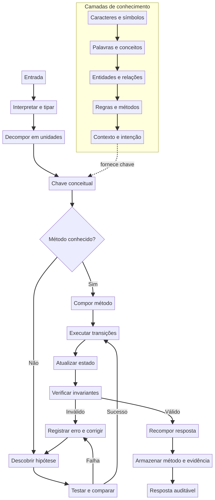
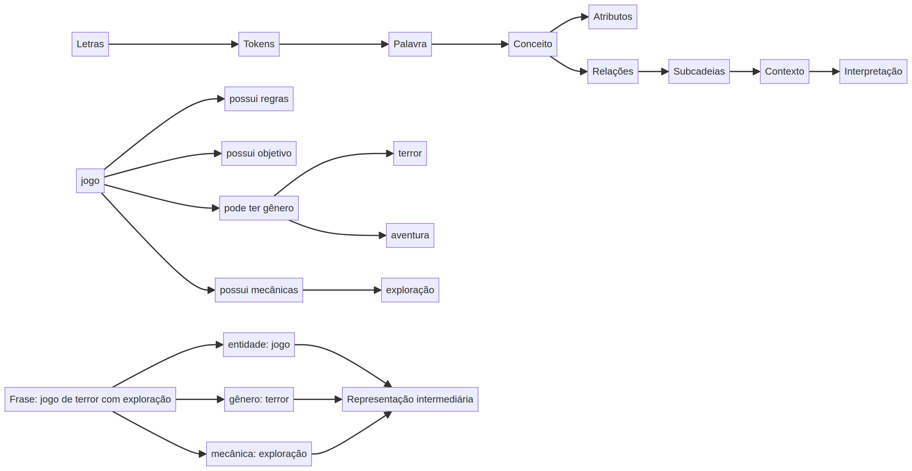
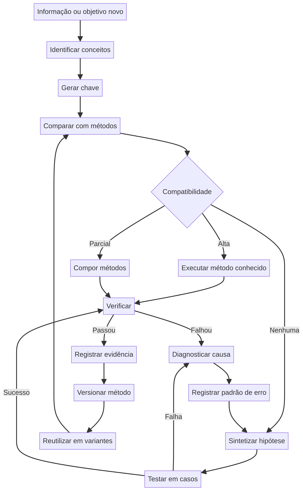
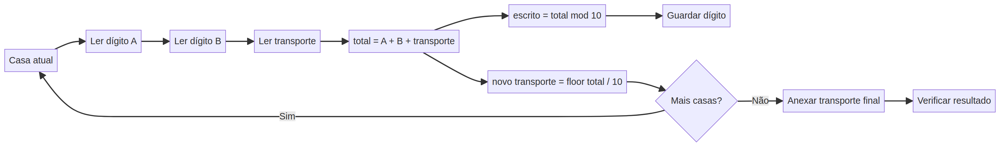

# Diagramas da arquitetura

Os arquivos `.mmd` são as fontes editáveis em Mermaid. Os arquivos `.png` são renderizações prontas para leitura no GitHub.

## Arquitetura geral

[Editar fonte Mermaid](architecture.mmd)

## Camada de palavras e significados

[Editar fonte Mermaid](word-layer.mmd)

## Ciclo adaptativo

[Editar fonte Mermaid](adaptive-loop.mmd)

## Exemplo aritmético

[Editar fonte Mermaid](arithmetic-state.mmd)

## Convenção

Os diagramas mostram relações e fluxos; eles não substituem os contratos, os dados e os testes do código. Quando uma regra mudar, atualize primeiro a fonte `.mmd`, renderize novamente o `.png` e verifique a leitura visual.

Os contratos estruturais correspondentes estão em [`../schemas/`](../schemas/): chave conceitual, método reutilizável e padrão de erro.
